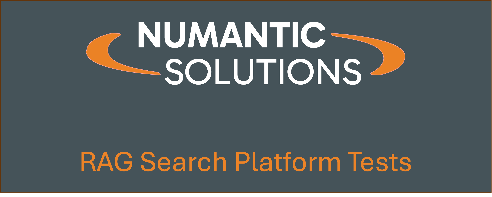
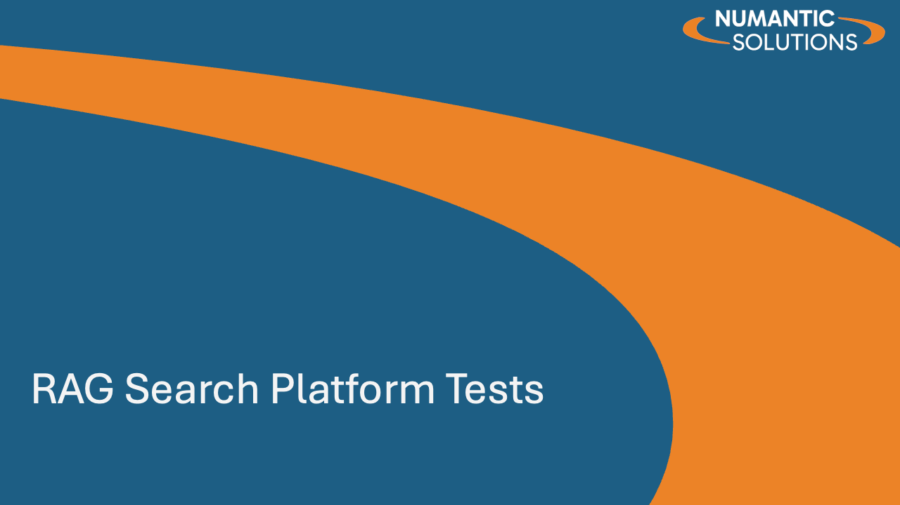
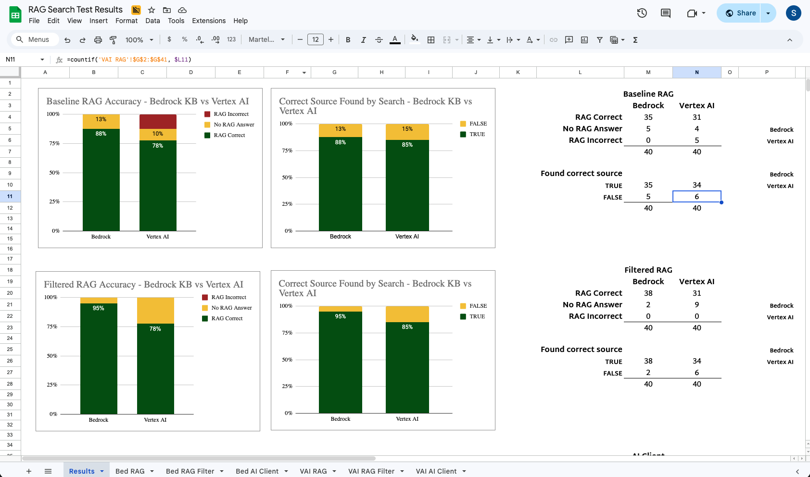

<div style="text-align: center;">

</div> 

# RAG Search Testing

This repository evaluates turnkey RAG (Retrieval Augmented Generation) solutions from AWS and GCP, provides working code examples for practitioners, and explores techniques for improving retrieval quality and user experience.

## Project Objectives

### 1. Evaluate Turnkey RAG Solutions
Compare AWS Bedrock Knowledge Base and GCP Vertex AI Search across two dimensions:
- **Ease of deployment** — time and complexity required to go from raw documents to a working RAG endpoint, including infrastructure setup, permissions, and data ingestion
- **Quality of responses** — accuracy of document retrieval and relevance of generated answers against a standardized evaluation dataset

### 2. Provide Jumpstart Code Examples
All code is written to be readable and reusable. Each cloud implementation is self-contained in its own directory, with modular Python utilities that can be adapted to other projects. Notebooks walk through every step of the pipeline from data loading to querying, making it straightforward to adapt the code for a new dataset or cloud environment.

### 3. Explore Techniques for Improving RAG Responses
Beyond baseline RAG, the notebooks investigate techniques that can improve retrieval and answer quality.

### 4. Provide simple RAG examples helping builders develop intuition into how these tools work and how they might be improved
Because RAG tools often operate a large amounts of unstructured data and measuring performance is challenging, it's helpful to have a small number of digestable examples to gain intuition on how these platform perform.

---
## Resources

### Production Deployments
| **Presentation Covering the Work**                                                                                                                                                                                                      | **Test Questions and RAG responses**                                                                                                                                                                                                                                                                       |
|:----------------------------------------------------------------------------------------------------------------------------------------------------------------------------------------------------------------------------------------|:-----------------------------------------------------------------------------------------------------------------------------------------------------------------------------------------------------------------------------------------------------------------------------------------------------------|
| <div style="text-align: center;"><a href="./data/images/RAG_Platform_Tests_V1.pdf"><p>Click to view the presentation</p></a></div> | <div style="text-align: center;"><a href="https://docs.google.com/spreadsheets/d/1eXTQMtT6YsKCSbpxKjGMv24B3E7aR-WDd6dB-zlkVkc/edit?usp=sharing"><p>Click to see test questions</p></a></div> |


---
## Repository Structure

```
rag_search/
├── data/
│   └── rag_eval_dataset/          # Shared evaluation dataset (CSV + metadata JSON)
├── aws_bedrock/                   # AWS Bedrock Knowledge Base implementation
│   ├── README.md
│   ├── S10_load_data_s3.ipynb
│   ├── S20_build_bedrock_knowledgebase.ipynb
│   ├── S30_search_bedrock_knowledgebase.ipynb
│   ├── s3_data_load.py
│   ├── bedrock_kb_security_build.py
│   ├── bedrock_kb_build.py
│   └── bedrock_kb_query.py
└── gcp_vertexai/                  # GCP Vertex AI Search implementation
    ├── README.md
    ├── S10_load_data_bq.ipynb
    ├── S12_load_data_gcs.ipynb
    ├── S20_build_vertexai_search_app.ipynb
    ├── S30_query_vertexai_searchapp.ipynb
    ├── gcs_data_load.py
    ├── vai_search_app_build.py
    └── vai_search_app_query.py
```

Each cloud directory contains its own `README.md` with detailed descriptions of every notebook and Python module, authentication setup, and configuration parameters.

---
## Evaluation Dataset

Both implementations are tested against the **Single-Topic RAG Evaluation Dataset** originally created by Samuel Matsuo Harris, available on [Kaggle](https://www.kaggle.com/datasets/samuelmatsuoharris/single-topic-rag-evaluation-dataset).

The dataset contains 120 question-answer pairs across 20 documents, designed to test three retrieval scenarios:
- Questions with **no answer** in the document corpus (40)
- Questions requiring a **single passage** from one document (40)
- Questions requiring **multiple passages** from one document (40)

---
## Cloud Implementations

### AWS Bedrock Knowledge Base
Located in `aws_bedrock/`. Uses Amazon Bedrock Knowledge Bases backed by OpenSearch Serverless with Amazon Titan Embed Text v2 embeddings. Documents are stored in S3 with JSON metadata sidecars. See [`aws_bedrock/README.md`](aws_bedrock/README.md) for details.

### GCP Vertex AI Search
Located in `gcp_vertexai/`. Uses Google Cloud Vertex AI Search with Enterprise tier and LLM add-on. Documents are stored in GCS and optionally indexed in BigQuery. The search engine is configured with a custom schema enabling metadata filtering and faceted navigation. See [`gcp_vertexai/README.md`](gcp_vertexai/README.md) for details.

---
*Developed by [Numantic Solutions](https://numanticsolutions.com/#)*
